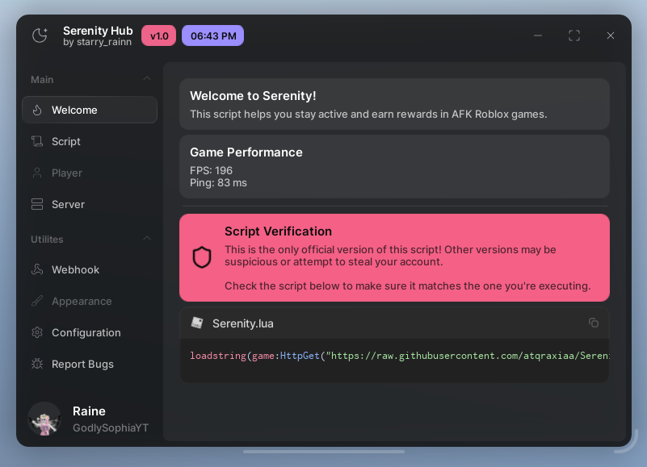

# 🌙 Serenity Lua Script

> **A sleek Roblox utility hub built for stability, automation, and smooth server management.**  
> Serenity provides a modern WindUI interface with tools for server hopping, auto-reconnects, anti-AFK, and more all wrapped in a single, configurable script.

---

## ✨ Features

| Feature | Description |
|----------|--------------|
| 🔁 **Server Hop** | Manually join a random server with available slots. |
| 🧭 **Desired Game Version** | Rejoins only servers matching your chosen game version. |
| ♻️ **Auto Reconnect** | Instantly rejoins the game if you get disconnected. |
| 💤 **Anti-AFK** | Prevents Roblox from kicking you for inactivity. |
| 🆔 **Get Job ID** | Displays your current server's Job ID for debugging or sharing. |
| 📡 **Webhook Integration** | Sends join or reconnect logs to a Discord webhook for monitoring. |

---

## ⚙️ Configuration

All user settings are saved to a JSON file for persistence between sessions.

```
/Workspace/Serenity_Main/MainConfig.json
```

You can reset the configuration anytime through the GUI.

---

## 🚀 Usage

1. **Execute the script** in your preferred Roblox executor.
```
loadstring(game:HttpGet("https://raw.githubusercontent.com/atqraxiaa/SerenityHub/refs/heads/main/Serenity_Loader.lua"))()
```
2. Wait a few seconds for the UI to initialize.
3. Configure your desired options in the **Config** and **Server** tabs.
4. Serenity automatically saves your settings after each change.

---

## 🧠 Auto-Execution

If your executor supports auto-execution, you can place the script in a file and move it into your executor’s autoexec folder.  
This ensures Serenity loads automatically when you join the game.

---

## 💬 Webhook Integration (Work in Progress)

You can configure your Discord webhook URL inside the script, via the Webhook tab.  
It will automatically log teleport events, reconnects, and server info.

Example webhook output:
```
[Serenity] Reconnected to server:
- JobId: 3ef2bfc1-xxxx
- Players: 7/12
```

---

## 📸 Preview



---

## 🧑‍💻 Credits

- 💜 **Developed by:** `allyqnts`
- 🌀 **UI Framework:** [WindUI by Footagesus](https://github.com/Footagesus/WindUI)

---

## 🪶 License

This project is distributed for educational and personal use only.  
You may modify and share it with credit to the original author.
